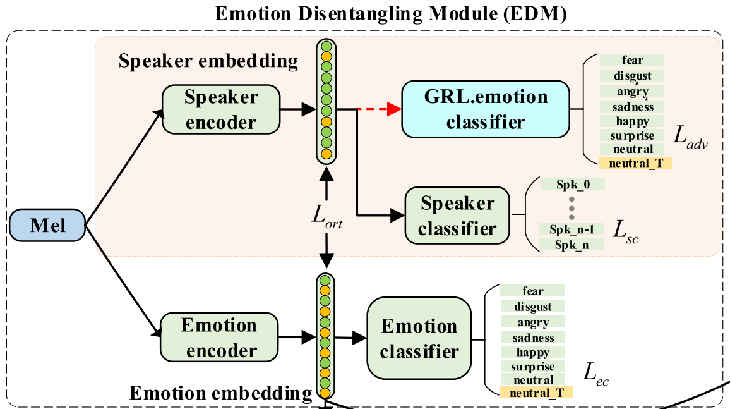
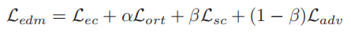
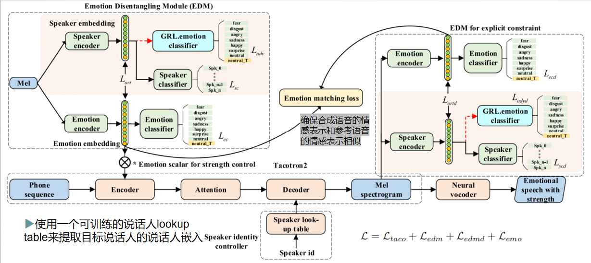

- 名称: Cross-Speaker Emotion Disentangling and Transfer
for End-to-End Speech Synthesis
- 链接: [arxiv](https://arxiv.org/pdf/2109.06733.pdf)
- 期刊: IEEE/ACM Transactions on Audio, Speech and Language Processing, Volume 30, pp 1448–1460.
- 时间: 2022.4

# 语音合成 (Text-to-speech, TTS)

在深度学习的推动下，语音合成在自然度和音质上得到了极大提升。然而人类的语音中不止有语义信息，还有情感信息。早期的端到端语音合成模型关注于生成普通的语音，没有明确地将情绪纳入考虑范围。这一点在近几年得到了关注。

# 语音情感迁移 (Emotion Transfer)

在语音合成的基础上加入情感，形成了语音情感迁移任务。  
任务目标：在保障语音自然的基础上，通过迁移原说话人的情感，合成出可控的，富有情绪的语音。

根据情感是否从一个人转移到另一个人，将语音合成中的情感迁移粗略地分为:
- same-speaker：同一说话人，不同的情感。
- cross-speaker：将情感从源说话人迁移到目标说话人。（在合成目标说话人的声音时可以表达出各种在目标说话人数据中不存在的情感）

## 常用的实现方式

学习一个与说话人无关的情感表示。（Reference Encoder、global style tokens、VAE）

从参考音频中提取出所需要的情感表示，然后将其作为一个变量加入生成过程。

## 存在的问题

### 源说话人的音色泄露

在情感迁移的过程中，源说话人的身份信息也会影响合成结果。合成出的语音听上去可能会像原说话人而不是目标说话人。  
为了缓和这一问题，现有的模型在转换质量和身份保留之间进行了权衡，生成的语音要么情感表现力不够，要么存在源说话人泄露的问题。

### 情感强度控制

录制一个 带有不同情感类别和强度标签的情感语音数据库非常困难。现有的很多cross-speaker方法只关注于不带强度控制的情感语音合成。而最近提出的情感强度控制的方法又都是针对same-speaker。

是否有可能 使用一个没有人工标注强度信息的语音数据库训练模型，而且还能控制合成语音的情绪强度？

# 建模方案

- 一种基于解耦语音中情感和说话人成分的跨说话人情感迁移。
- 基于Tacotron2的TTS系统，通过两个子模块对语音中的情感和说话人成分进行有效地解耦和限制。
- 在一个模型框架下，实现将情感从源说话人迁移到目标说话人，使目标说话人的合成语音能够表达目标说话人的训练数据中不存在的各种情感。
- 此外，还提出了一个直观的方法来控制合成语音中目标说话人的情感强度。

## EDM模块

为了得到 说话人无关而情绪有区别的 情绪嵌入。

### speaker encoder

- classification loss (speaker identities) 

    具有对说话人身份的判别性，同时不包含与情感相关的信息。

- Gradient Reversal Layer based classification loss (emotion categories) 

    梯度反转层，在情感分类任务中反向优化说话人编码

### emotion encoder

- classification loss (emotion categories)

> 将emotion embedding的值看作情绪相关特征的强度
> 在推理阶段，使用一个emotion scalar与emotion embedding相乘来控制情绪传递的强度。（训练时scalar为1）

